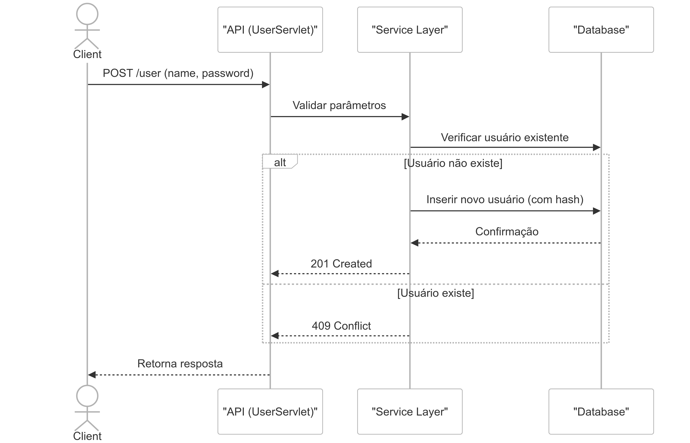

```markdown
# Atina - Sistema de Gerenciamento de Autopeças


Sistema completo para gestão de inventário de peças automotivas, com controle de usuários, produtos e imagens.

## 🚀 Recursos Principais
- Cadastro de usuários com senhas criptografadas (BCrypt)
- Gestão de produtos com estados (disponível/reservado/vendido)
- Upload e vinculação de imagens aos produtos
- API RESTful com documentação OpenAPI
- Interface web moderna com Next.js
- Containerização com Docker e orquestração via docker-compose

## 🛠 Tecnologias
**Linguagens:**  
- Backend: Java 21
- Frontend: TypeScript

**Frameworks:**  
- Jakarta Servlet (Tomcat 11)
- Next.js 14

**Bibliotecas:**  
- Commons FileUpload
- JSON Processing
- BCrypt
- React 18

## 📁 Estrutura do Projeto
```
.
├── app/
│   ├── backend/          # Aplicação Java (Maven)
│   │   ├── src/main/java/com/atina
│   │   │   ├── config/    # Configuração de banco
│   │   │   ├── controller # Lógica das APIs
│   │   │   ├── model/     # Entidades JPA
│   │   │   └── service/  # Regras de negócio
│   ├── frontend/         # Aplicação Next.js
│   │   ├── src/app/      # Componentes React
│   │   └── public/       # Assets estáticos
├── docs/                 # Documentação API
└── scripts/              # DDL do banco
```

## 🗃 Banco de Dados (MySQL)
```sql
-- Tabela de Usuários
CREATE TABLE user (
    id INT AUTO_INCREMENT PRIMARY KEY,
    name VARCHAR(100) NOT NULL,
    password VARCHAR(255) NOT NULL
);

-- Tabela de Produtos com estado
CREATE TABLE product (
    id INT PRIMARY KEY,
    user_id INT,
    state ENUM('disponível', 'reservado', 'vendido')
    -- ... outros campos
);

-- Tabela de Imagens
CREATE TABLE product_images (
    product_id INT,
    image_url VARCHAR(100)
);
```

## ⚙️ Configuração
### Pré-requisitos
- Docker 23+
- docker-compose 2.20+

### Instalação
```bash
git clone https://github.com/seu-usuario/atina.git
cd atina/app
docker-compose up --build
```

Acesse:
- Frontend: http://localhost:3000
- Backend: http://localhost:8080
- MySQL: porta 3306 (usuário: user, senha: root)

## 🌐 Documentação da API
Especificações OpenAPI disponíveis em `/docs`:
- `UserApi.yaml` - Endpoints de usuário
- `ProductApi.yaml` - Operações com produtos



## 📌 Notas de Desenvolvimento
**Variáveis de Ambiente:**
```env
# Backend
DB_URL=jdbc:mysql://db:3306/atina
DB_USER=user
DB_PASSWORD=root

# Frontend
NEXT_PUBLIC_API_URL=http://backend:8080
```

**Build Manual:**
```bash
# Backend
mvn clean package
# Frontend
pnpm install && pnpm build
```

## 🤝 Contribuição
1. Faça um fork do projeto
2. Crie sua branch (`git checkout -b feature/nova-funcionalidade`)
3. Commit suas mudanças (`git commit -m 'Add nova funcionalidade'`)
4. Push para a branch (`git push origin feature/nova-funcionalidade`)
5. Abra um Pull Request

---

[](https://opensource.org/licenses/MIT)
```
